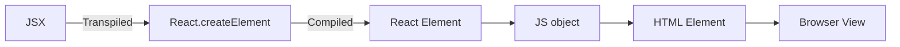

# JSX and Babel

1. To skip the process of using **npx** , we can instead intorduce scripts inside our ***package.json*** instead to use them using npm. Following lines are added under the script object
```
    "start": "parcel index.html",
    "build": "parcel build index.html"
```
and we use **npm run start** to start the project and **npm run build** to build the project.<br><br>
2. **React Element** is basically a Javascript Object and not a HTMl Object , so behind the scene , React Element is first converted into a js object and then it is rendered to the HTML where we are able to see that in the browser view.


<br>

3. ***JSX*** is a syntax extension for JavaScript that is commonly used with React to describe what the UI should look like. It allows you to write HTML-like syntax directly within JavaScript, making it easier to create and visualize the structure of the user interface.<br><br>
4. ***JSX*** basically becomes **React Element** after processing from parcel. Internally , JSX and React Element are the same.<br><br>
5. ***JSX*** and ***React*** cannot be understood by the browser as browser only understands ***ES6***.<br><br>
6. ***JSX*** is **Transpiled** to **ES6** so that the browsers can understand this.<br><br>
7. ***Transpilation*** means when we are converting one high level language into another high level language. The source code file is taken and is converted into another source code file in some other language or a different version of the same language. The ouput is generally understandable by a human.<br><br>
8. This all is done by JS Compiler called **Babel**. It transpiles and compiles the ***JSX*** and converts into **ES6**
9. So basically , the following flowchart is followed

<br>

10. Attributes in ***JSX*** are always in camelcase.<br><br>
11. If we have to write multiple lines of JSX , then we use () brackets because it helps babel figure out that where exactly is JSX inside the React code.<br><br> 